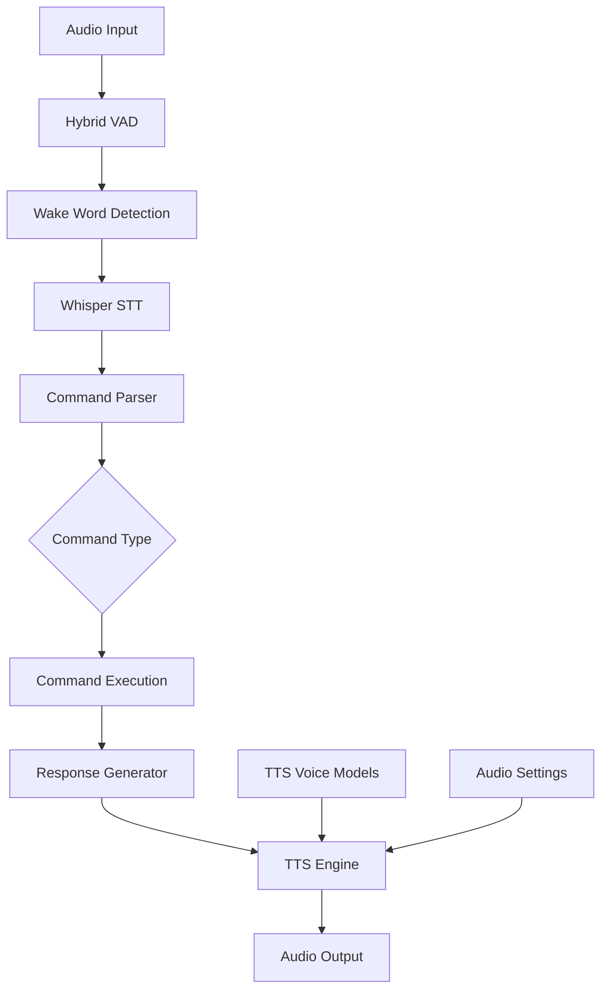
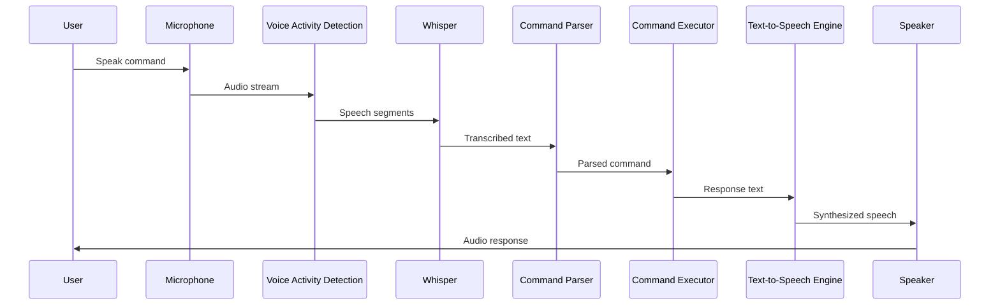

# Text-to-Speech Integration Analysis

## Overview

This document analyzes how different Text-to-Speech (TTS) engines would integrate with our Whisper-based speech recognition system in the Genie Whisper Jarvis-like assistant. We focus on Mozilla TTS and Spark-TTS as potential candidates for our local, free implementation.

## Integration Architecture



## TTS Engine Options

### 1. Mozilla TTS

**Description**: A deep learning-based TTS model offering real-time previews.

**Features**:
- GPU acceleration for fast processing
- High-quality output with advanced signal processing
- Customizable by developers familiar with Python
- Open-source and completely local

**Drawbacks**: 
- Limited language support compared to newer models
- Requires more setup and configuration

**Integration with Whisper**:
- **Technical Compatibility**: Both Whisper and Mozilla TTS are Python-based, making integration straightforward
- **Pipeline Flow**: Whisper output → Text processing → Mozilla TTS input → Audio output
- **Resource Sharing**: Can share GPU resources with Whisper for acceleration
- **Development Complexity**: Medium - requires Python knowledge but has good documentation

**Implementation Approach**:
```python
# Example integration code
from TTS.api import TTS
import numpy as np

class TTSEngine:
    def __init__(self, model_name="tts_models/en/ljspeech/tacotron2-DDC", use_gpu=True):
        self.tts = TTS(model_name=model_name, gpu=use_gpu)
        
    def synthesize(self, text, output_path=None):
        # Generate speech from text
        wav = self.tts.tts(text)
        
        if output_path:
            self.tts.tts_to_file(text, output_path)
            
        return wav
        
    def get_available_voices(self):
        return self.tts.list_models()
```

**Resource Requirements**:
- Disk space: 300-500MB for models
- RAM: 500MB-1GB during operation
- GPU: Optional but beneficial for faster synthesis
- CPU: Multi-core recommended for real-time performance

### 2. Spark-TTS

**Description**: A cutting-edge model with 500 million parameters, supporting zero-shot voice cloning and bilingual synthesis (Chinese and English).

**Features**:
- Customizable voice creation with control over pitch, speaking style, and rate
- Supports gender-specific voice adjustments
- Zero-shot voice cloning capabilities
- High-quality, natural-sounding output

**Drawbacks**: 
- Limited to Chinese and English languages
- Larger model size requires more resources

**Integration with Whisper**:
- **Technical Compatibility**: Can be integrated with Whisper through Python interfaces
- **Pipeline Flow**: Whisper output → Text processing → Spark-TTS input → Audio output
- **Resource Sharing**: Higher resource requirements may compete with Whisper
- **Development Complexity**: Medium-High - newer system with less documentation

**Implementation Approach**:
```python
# Example integration code (conceptual)
from spark_tts import SparkTTS
import numpy as np

class TTSEngine:
    def __init__(self, model_path="models/spark_tts_en", use_gpu=True):
        self.tts = SparkTTS(model_path=model_path, use_gpu=use_gpu)
        
    def synthesize(self, text, voice_style="neutral", pitch=0.0, rate=1.0):
        # Generate speech from text with customization
        wav = self.tts.synthesize(
            text, 
            voice_style=voice_style,
            pitch_adjustment=pitch,
            speaking_rate=rate
        )
        
        return wav
        
    def clone_voice(self, reference_audio_path, text):
        # Zero-shot voice cloning
        return self.tts.clone_and_synthesize(reference_audio_path, text)
```

**Resource Requirements**:
- Disk space: 1-2GB for models
- RAM: 2-4GB during operation
- GPU: Strongly recommended for reasonable performance
- CPU: High-end multi-core for CPU-only operation

## Comparative Analysis

| Feature | Mozilla TTS | Spark-TTS | Impact on Integration |
|---------|------------|-----------|----------------------|
| **Voice Quality** | Good | Excellent | Higher quality improves user experience |
| **Performance** | Fast with GPU | Requires more resources | Resource balancing with Whisper needed |
| **Language Support** | Limited | Chinese & English | May limit international usage |
| **Customization** | Good | Excellent | More customization options for Spark-TTS |
| **Resource Usage** | Moderate | High | Spark-TTS may require better hardware |
| **Integration Complexity** | Medium | Medium-High | Mozilla easier to integrate initially |
| **Community Support** | Strong | Growing | Mozilla has more examples and documentation |
| **Voice Cloning** | Limited | Built-in | Spark-TTS offers more advanced voice features |

## Integration with Whisper Speech Recognition

### Data Flow Architecture



### Technical Integration Considerations

1. **Audio Pipeline Sharing**:
   - Both Whisper and TTS engines need access to audio devices
   - Need to manage audio device handover between input and output
   - Consider using a unified audio manager component

2. **Resource Management**:
   - Both systems benefit from GPU acceleration
   - Need to balance GPU memory usage between STT and TTS
   - Consider sequential processing to avoid resource contention

3. **Latency Optimization**:
   - End-to-end latency affects conversational experience
   - Optimize each component for minimum processing time
   - Consider pre-loading models and caching common responses

4. **Error Handling**:
   - Implement fallbacks for TTS failures
   - Handle language detection and routing
   - Provide visual feedback during audio processing

## Implementation Recommendations

### For Mozilla TTS

1. **Setup and Installation**:
   ```bash
   pip install TTS
   python -m TTS.server.server
   ```

2. **Model Selection**:
   - For English: `tts_models/en/ljspeech/tacotron2-DDC`
   - For faster inference: `tts_models/en/ljspeech/fast_pitch`

3. **Integration Code**:
   ```python
   from TTS.api import TTS
   
   # Initialize TTS with the selected model
   tts = TTS(model_name="tts_models/en/ljspeech/fast_pitch", gpu=True)
   
   # Function to generate speech
   def generate_speech(text, output_path=None):
       if output_path:
           tts.tts_to_file(text, output_path)
           return output_path
       else:
           wav = tts.tts(text)
           return wav
   ```

4. **Audio Output**:
   ```python
   import sounddevice as sd
   import numpy as np
   
   def play_audio(wav, sample_rate=22050):
       sd.play(np.array(wav), sample_rate)
       sd.wait()
   ```

### For Spark-TTS

1. **Setup and Installation**:
   ```bash
   # Clone the repository
   git clone https://github.com/HighCWu/spark-tts
   cd spark-tts
   pip install -e .
   ```

2. **Model Download**:
   ```python
   from spark_tts.download import download_model
   
   # Download English model
   download_model("en")
   ```

3. **Integration Code**:
   ```python
   from spark_tts import SparkTTSAPI
   
   # Initialize TTS with the downloaded model
   tts_api = SparkTTSAPI(model_dir="models/spark_tts_en", device="cuda")
   
   # Function to generate speech
   def generate_speech(text, voice_style="neutral", output_path=None):
       wav, sr = tts_api.synthesize(
           text, 
           voice_style=voice_style,
           speaking_rate=1.0
       )
       
       if output_path:
           import soundfile as sf
           sf.write(output_path, wav, sr)
           return output_path
       else:
           return wav, sr
   ```

4. **Voice Cloning**:
   ```python
   def clone_voice(reference_audio, text):
       wav, sr = tts_api.clone_voice(reference_audio, text)
       return wav, sr
   ```

## Recommended Approach

Based on our analysis, we recommend the following approach:

1. **Initial Implementation**: Start with **Mozilla TTS** due to:
   - Better documentation and community support
   - Easier integration with existing Python codebase
   - Lower resource requirements
   - More mature ecosystem

2. **Future Enhancement**: Explore **Spark-TTS** as a second phase:
   - Implement as an optional "high quality" voice mode
   - Add voice cloning features for personalization
   - Provide as an advanced option for users with better hardware

3. **Hybrid Approach**: Consider implementing a pluggable TTS architecture:
   - Create a common interface for TTS engines
   - Allow runtime switching between engines
   - Enable users to choose based on their preferences and hardware

## Integration with Existing Codebase

To integrate the selected TTS engine with our existing Whisper-based speech recognition:

1. **Create a TTS Service Module**:
   ```python
   # tts_service.py
   class TTSService:
       def __init__(self, engine_type="mozilla", use_gpu=True):
           self.engine_type = engine_type
           self.use_gpu = use_gpu
           self.engine = self._initialize_engine()
           
       def _initialize_engine(self):
           if self.engine_type == "mozilla":
               from TTS.api import TTS
               return TTS(model_name="tts_models/en/ljspeech/fast_pitch", gpu=self.use_gpu)
           elif self.engine_type == "spark":
               from spark_tts import SparkTTSAPI
               return SparkTTSAPI(model_dir="models/spark_tts_en", device="cuda" if self.use_gpu else "cpu")
           else:
               raise ValueError(f"Unsupported TTS engine: {self.engine_type}")
               
       def speak(self, text):
           if self.engine_type == "mozilla":
               wav = self.engine.tts(text)
               sample_rate = 22050
           elif self.engine_type == "spark":
               wav, sample_rate = self.engine.synthesize(text)
               
           # Play audio
           import sounddevice as sd
           import numpy as np
           sd.play(np.array(wav), sample_rate)
           sd.wait()
           
           return wav
   ```

2. **Connect with Command Processing Pipeline**:
   ```python
   # command_processor.py
   from tts_service import TTSService
   
   class CommandProcessor:
       def __init__(self):
           self.tts_service = TTSService(engine_type="mozilla", use_gpu=True)
           
       def process_command(self, command_text):
           # Process command logic here
           response_text = self._execute_command(command_text)
           
           # Speak the response
           self.tts_service.speak(response_text)
           
       def _execute_command(self, command_text):
           # Command execution logic
           return f"I processed your command: {command_text}"
   ```

3. **Add to Main Application Flow**:
   ```python
   # main.py
   from whisper_service import WhisperService
   from command_processor import CommandProcessor
   
   class GenieWhisper:
       def __init__(self):
           self.whisper_service = WhisperService()
           self.command_processor = CommandProcessor()
           
       def process_audio(self, audio_data):
           # Transcribe audio using Whisper
           transcription = self.whisper_service.transcribe(audio_data)
           
           # Process the transcribed command
           self.command_processor.process_command(transcription)
   ```

## Conclusion

Both Mozilla TTS and Spark-TTS offer viable options for adding voice output capabilities to our Genie Whisper Jarvis-like assistant. Mozilla TTS provides a more mature, easier-to-integrate solution with moderate resource requirements, making it ideal for our initial implementation. Spark-TTS offers superior voice quality and advanced features like voice cloning, but with higher resource requirements and implementation complexity.

By starting with Mozilla TTS and designing a pluggable architecture, we can provide a solid voice experience immediately while leaving the door open for enhanced capabilities with Spark-TTS in the future. This approach balances immediate functionality with long-term flexibility and quality improvements.