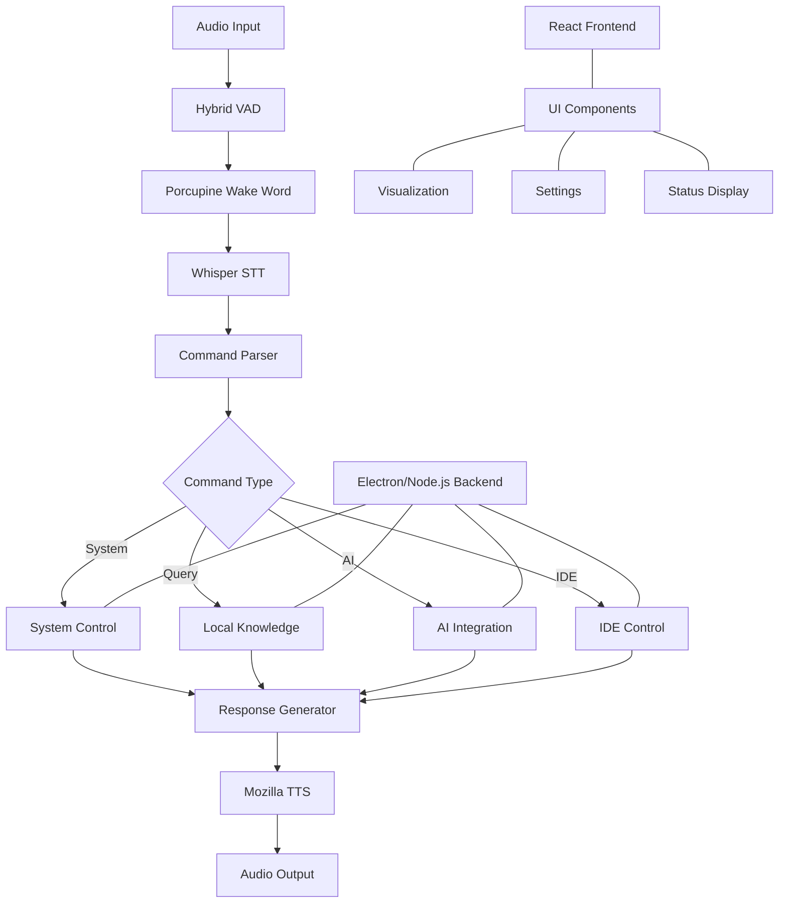

# Current Voice Assistant Tech Stack (2023-2024)

## Introduction

This document outlines the current state-of-the-art technologies available for building a Jarvis-like voice assistant that runs locally and remains free from cloud dependencies. We focus on technologies that are proven, available now, and can be implemented immediately.

## Executive Summary

The current landscape of voice assistant technologies offers several viable options for building a local, privacy-focused assistant:

1. **Local Speech Recognition**: OpenAI Whisper provides excellent accuracy and runs locally
2. **Text-to-Speech**: Several high-quality open-source options are available
3. **Voice Activity Detection**: Hybrid approaches offer the best reliability
4. **Wake Word Detection**: Open-source and free-tier commercial options exist
5. **System Integration**: Multiple frameworks for desktop application development

Our recommended stack leverages these technologies to create a powerful, private, and efficient voice assistant.

## Speech Recognition (STT)

### OpenAI Whisper (Recommended)

**Current Status**: Whisper is a state-of-the-art speech recognition system released by OpenAI in September 2022, with ongoing updates. The latest release as of early 2023 is available on GitHub.

**Key Features**:
- Excellent accuracy (90%+ for general speech)
- Multilingual support (99+ languages)
- Robust to accents and background noise
- Fully open-source (Apache 2.0 license)
- Multiple model sizes for different performance needs

**Performance Metrics**:
- Tiny model: 39M parameters, ~75MB, fast on CPU
- Base model: 74M parameters, ~150MB, good for real-time on CPU
- Small model: 244M parameters, ~500MB, requires decent CPU or GPU
- Medium model: 769M parameters, ~1.5GB, benefits from GPU
- Large model: 1550M parameters, ~3GB, requires GPU for reasonable performance

**Integration Complexity**: Medium
- Python API via PyTorch
- Community-built wrappers for various languages
- Requires custom implementation for streaming in production

### Mozilla DeepSpeech

**Current Status**: While Mozilla officially stopped supporting DeepSpeech in 2022, the community continues to maintain it, and it remains a viable option for specific use cases.

**Key Features**:
- Fully open-source (Mozilla Public License)
- Good for command recognition
- Lower accuracy than Whisper but faster inference
- Better streaming support out of the box

**Performance Metrics**:
- Model size: ~200MB
- CPU usage: Moderate
- Memory usage: ~500MB during operation

**Integration Complexity**: Medium
- C++, Python, JavaScript, and Node.js bindings
- Good documentation
- Active community support

### Vosk

**Current Status**: Actively maintained open-source speech recognition toolkit.

**Key Features**:
- Designed for offline use
- Small model sizes (50-200MB)
- Good for specific domains with custom vocabulary
- Excellent streaming support
- Multiple language models available

**Performance Metrics**:
- Small models: ~50MB, very fast on CPU
- Large models: ~200MB, good accuracy on CPU

**Integration Complexity**: Low
- Simple API in multiple languages
- Good documentation
- Easy integration with audio systems

## Text-to-Speech (TTS)

### Mozilla TTS (Recommended for Free & Local)

**Current Status**: Actively maintained open-source TTS system.

**Key Features**:
- High-quality voices with natural prosody
- Open-source (Mozilla Public License)
- Multiple language support
- Active community development
- Good documentation
- Completely free and runs locally

**Performance Metrics**:
- Model size: 200-500MB per voice
- Generation speed: 5-10x realtime on CPU
- Memory usage: ~300MB during operation

**Integration Complexity**: Medium
- Python API
- Good documentation
- Active community support

### OpenAI TTS

**Current Status**: OpenAI offers high-quality TTS through their API service.

**Key Features**:
- Extremely natural-sounding voices
- Multiple voice options (Alloy, Echo, Fable, Onyx, Nova, Shimmer)
- Excellent prosody and emotion
- Multilingual support
- SSML support for fine control

**Cost Considerations**:
- Not free - requires OpenAI API key and payment
- Pricing based on character count
- Requires internet connection
- Not suitable for completely local, free solution

**Integration Complexity**: Low
- Simple REST API
- Good documentation
- Easy integration with most languages

### Piper TTS

**Current Status**: Newer open-source TTS system focused on performance.

**Key Features**:
- Very fast neural TTS (20-50x realtime)
- Multiple voice options
- Low resource usage
- Completely local operation
- Simple API
- Completely free

**Performance Metrics**:
- Model size: 50-100MB per voice
- Generation speed: 20-50x realtime on CPU
- Memory usage: ~150MB during operation

**Integration Complexity**: Low
- Simple Python API
- Minimal dependencies
- Easy to integrate

### Coqui TTS

**Current Status**: Actively maintained fork of Mozilla TTS with additional features.

**Key Features**:
- High-quality voices
- Multiple model architectures
- Good multilingual support
- Active development
- Completely free and local

**Performance Metrics**:
- Model size: 200-500MB per voice
- Generation speed: 3-8x realtime on CPU
- Memory usage: ~300MB during operation

**Integration Complexity**: Medium
- Python API
- Good documentation
- Active community support

## Voice Activity Detection (VAD)

### Hybrid Approach (Recommended)

**Current Status**: Combining WebRTC VAD and Silero VAD provides the best results.

**Key Features**:
- WebRTC VAD is lightweight and fast
- Silero VAD is more accurate but heavier
- Hybrid approach provides redundancy
- Can adapt to different environments

**Performance Metrics**:
- WebRTC VAD: Minimal resource usage
- Silero VAD: ~10MB model size, low CPU usage
- Combined: Better accuracy than either alone

**Integration Complexity**: Medium
- Requires custom implementation
- Both components have good documentation
- Example implementations available

### Silero VAD

**Current Status**: Open-source VAD with good accuracy.

**Key Features**:
- Good accuracy in various environments
- Open-source (Apache 2.0 license)
- PyTorch-based
- Simple API

**Performance Metrics**:
- Model size: ~10MB
- CPU usage: Low
- Memory usage: ~50MB during operation

**Integration Complexity**: Low
- Simple Python API
- Good documentation
- Easy integration with audio systems

### WebRTC VAD

**Current Status**: Lightweight VAD included in the WebRTC project.

**Key Features**:
- Very lightweight
- Fast processing
- Simple API
- Good for basic use cases

**Performance Metrics**:
- Model size: Minimal
- CPU usage: Very low
- Memory usage: Minimal

**Integration Complexity**: Very Low
- Simple API in multiple languages
- Minimal setup
- Well-documented

## Wake Word Detection

### Picovoice Porcupine (Recommended)

**Current Status**: Commercial wake word detection with free tier.

**Key Features**:
- High accuracy (95%+ in quiet environments)
- Free tier available (3 wake words)
- Low resource usage
- Cross-platform support
- Custom wake word creation (paid feature)

**Performance Metrics**:
- Model size: ~1MB
- CPU usage: Very low
- Memory usage: ~10MB

**Integration Complexity**: Low
- Simple API in multiple languages
- Good documentation
- Easy integration

### Mycroft Precise

**Current Status**: Open-source wake word engine used in Mycroft AI.

**Key Features**:
- Fully open-source
- User-trainable wake words
- Moderate accuracy
- Privacy-focused

**Performance Metrics**:
- Model size: ~10MB
- CPU usage: Low
- Memory usage: ~50MB

**Integration Complexity**: Medium
- Python API
- Moderate documentation
- Requires some setup

### Snowboy (Community-Maintained)

**Current Status**: While officially discontinued, community forks continue to maintain this popular wake word detection system.

**Key Features**:
- Open-source
- User-trainable wake words
- Good accuracy
- Cross-platform

**Performance Metrics**:
- Model size: ~5MB
- CPU usage: Low
- Memory usage: ~30MB

**Integration Complexity**: Medium
- Python, Node.js, and C++ bindings
- Community documentation
- Requires some setup

## System Integration

### Electron with Node.js (Recommended)

**Current Status**: Mature and widely used framework for desktop applications.

**Key Features**:
- Cross-platform (Windows, macOS, Linux)
- Web technologies (HTML, CSS, JavaScript)
- Large ecosystem
- Native module support for system integration
- Good documentation and community support

**Performance Metrics**:
- Application size: 100-200MB
- Memory usage: 300-500MB
- CPU usage: Moderate

**Integration Complexity**: Low
- Well-documented
- Large ecosystem
- Many examples available

### Tauri

**Current Status**: Newer alternative to Electron with focus on efficiency.

**Key Features**:
- Much smaller application size
- Lower memory usage
- Uses system WebView instead of bundling Chromium
- Rust backend for security and performance

**Performance Metrics**:
- Application size: 10-20MB
- Memory usage: 50-100MB
- CPU usage: Low

**Integration Complexity**: Medium
- Requires Rust knowledge
- Growing documentation
- Smaller ecosystem than Electron

### Python with Qt/GTK

**Current Status**: Traditional desktop application development with Python.

**Key Features**:
- Native look and feel
- Good performance
- Direct integration with Python audio processing
- Cross-platform

**Performance Metrics**:
- Application size: 50-100MB
- Memory usage: 100-200MB
- CPU usage: Low to moderate

**Integration Complexity**: Medium
- Requires UI development knowledge
- Good documentation
- Mature ecosystem

## Local Knowledge Base

### SQLite with FTS5 (Recommended)

**Current Status**: Mature embedded database with full-text search.

**Key Features**:
- Extremely lightweight
- Reliable and battle-tested
- Full-text search capabilities
- Simple integration
- No server required

**Performance Metrics**:
- Database size: Depends on content
- Query speed: Very fast
- Memory usage: Minimal

**Integration Complexity**: Low
- Simple API in multiple languages
- Excellent documentation
- Many examples available

### Chroma

**Current Status**: Embedded vector database for AI applications.

**Key Features**:
- Designed for AI embeddings
- Good for semantic search
- Simple API
- Active development

**Performance Metrics**:
- Database size: Depends on content
- Query speed: Good for moderate-sized collections
- Memory usage: Moderate

**Integration Complexity**: Medium
- Python API
- Growing documentation
- Requires understanding of embeddings

### LMDB

**Current Status**: High-performance embedded key-value store.

**Key Features**:
- Extremely fast
- Memory-mapped files
- ACID transactions
- Cross-platform

**Performance Metrics**:
- Database size: Depends on content
- Query speed: Very fast
- Memory usage: Configurable

**Integration Complexity**: Medium
- C, Python, and other language bindings
- Good documentation
- Requires more setup than SQLite

## Implementation Architecture

For the Genie Whisper Jarvis-like assistant, we recommend the following architecture:

## Resource Requirements

For optimal performance of the complete system:

**Minimum Requirements**:
- CPU: 4-core modern processor (Intel i5/Ryzen 5 or better)
- RAM: 8GB
- Storage: 2GB for application and models
- GPU: Not required, but beneficial

**Recommended Requirements**:
- CPU: 6-core modern processor (Intel i7/Ryzen 7 or better)
- RAM: 16GB
- Storage: 5GB for application and all models
- GPU: Dedicated GPU with 4GB+ VRAM for larger Whisper models

## Development Roadmap

### Phase 1: Core Voice Pipeline (Weeks 1-4)
1. Implement Whisper for speech recognition
2. Integrate Mozilla TTS for voice responses
3. Add hybrid VAD approach
4. Implement Porcupine for wake word detection
5. Create basic command parser

### Phase 2: System Integration (Weeks 5-8)
1. Set up Electron with Node.js
2. Implement system control commands
3. Create React frontend with basic UI
4. Add settings management
5. Implement global hotkey system

### Phase 3: AI Integration (Weeks 9-12)
1. Integrate with Roo Code API
2. Add local knowledge base with SQLite
3. Implement context management
4. Create documentation indexing
5. Add IDE integration

### Phase 4: Advanced Features (Weeks 13-16)
1. Implement conversation history
2. Add automation capabilities
3. Create learning and personalization
4. Implement advanced voice interactions
5. Add multi-device synchronization

## Conclusion

The current technology landscape offers excellent options for building a powerful, local, and free Jarvis-like voice assistant. By leveraging OpenAI Whisper for speech recognition, Mozilla TTS or Piper TTS for voice responses, and Electron for system integration, we can create an assistant that:

1. Runs completely locally for privacy and reliability
2. Offers natural voice interaction in both directions
3. Integrates seamlessly with AI agents in IDEs
4. Controls system functions efficiently
5. Provides valuable information without cloud dependencies

While OpenAI does offer high-quality TTS models through their API, these are not free and require an internet connection. For our goal of a completely local and free solution, Mozilla TTS or Piper TTS provide excellent alternatives that can run entirely on the local machine.

This tech stack provides a solid foundation for Genie Whisper to evolve into a true Jarvis-like assistant that enhances productivity while respecting user privacy and control.