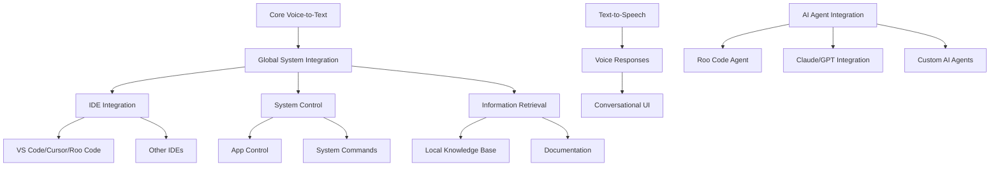
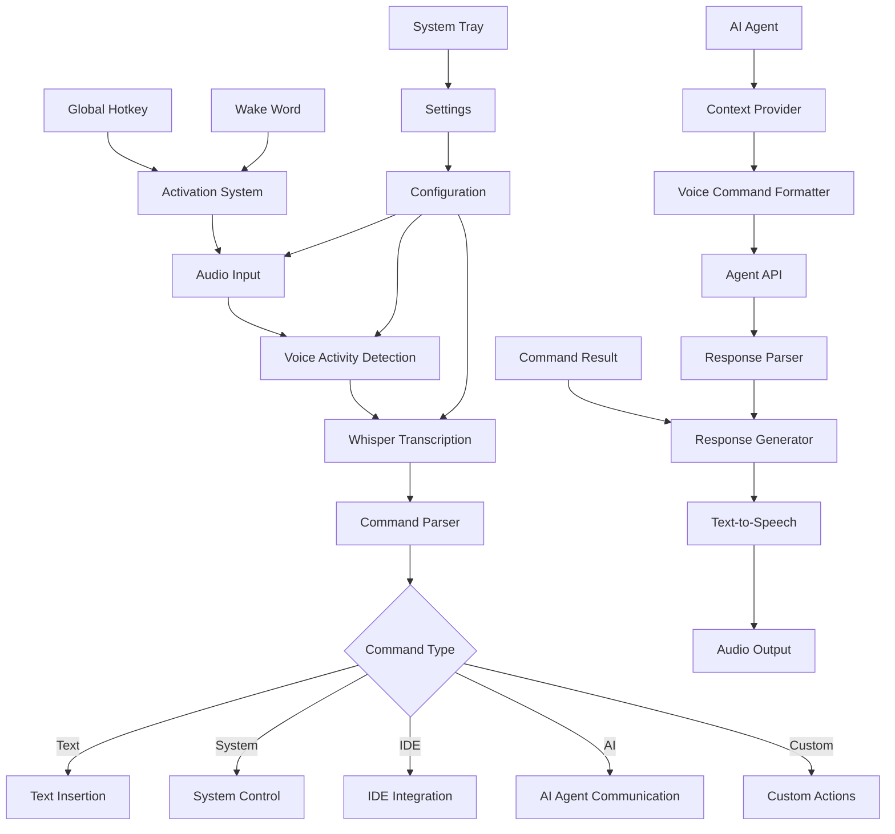

# Genie Whisper: Full Jarvis-Like Assistant Plan

## Vision

Transform Genie Whisper from a voice-to-text transcription tool into a full Jarvis-like voice assistant that works globally across all applications on your PC, including all IDEs and system functions. The desktop PC will serve as the main hub, with Genie Whisper able to both listen and talk back using text-to-speech. The solution will remain completely local and free, with no cloud dependencies.

## Current Status Assessment

Based on our repository analysis, we have:

- ✅ Project structure and documentation
- ✅ Basic UI components (but not fully functional)
- ✅ Partial backend structure
- ❌ No working end-to-end functionality
- ❌ Silero VAD model download issues
- ❌ No global system integration
- ❌ No text-to-speech capabilities
- ❌ No AI agent integration

## 2025 Tech Stack Research

For a cutting-edge Jarvis-like assistant in 2025, we recommend:

### Speech Recognition
- **Primary**: OpenAI Whisper (locally run)
- **Alternatives**: Mozilla DeepSpeech, Vosk, Kaldi
- **Advantages**: Whisper offers superior accuracy, multilingual support, and can run efficiently on consumer GPUs

### Text-to-Speech
- **Primary**: Piper TTS (locally run)
- **Alternatives**: Coqui TTS, Mozilla TTS, Mimic3
- **Advantages**: Piper offers high-quality voices with low latency and can run efficiently on CPU

### Voice Activity Detection
- **Primary**: Hybrid approach (WebRTC VAD + Silero VAD)
- **Alternatives**: Picovoice Cobra, Vosk VAD
- **Advantages**: Hybrid approach offers better accuracy in different environments

### Wake Word Detection
- **Primary**: Picovoice Porcupine (free tier)
- **Alternatives**: Snowboy, Mycroft Precise
- **Advantages**: Porcupine offers good accuracy with low resource usage

### AI Integration
- **Primary**: Direct integration with Roo Code, Claude, and GPT APIs
- **Alternatives**: LangChain for orchestration, Ollama for local models
- **Advantages**: Direct integration offers better control and performance

### System Integration
- **Primary**: Node.js native modules + OS-specific APIs
- **Alternatives**: Python with system libraries, Rust with FFI
- **Advantages**: Node.js with native modules offers good performance with Electron compatibility

### UI Framework
- **Primary**: Electron with React
- **Alternatives**: Tauri, Flutter Desktop
- **Advantages**: Electron offers mature cross-platform support and easy integration with web technologies

## Phase 1: Get Basic Genie Whisper Working (2 Weeks)

### 1. Fix Core Audio Pipeline
- **Priority**: Highest
- **Goal**: Create a working voice-to-text transcription system
- **Tasks**:
  - Fix Silero VAD model download issues (use WebRTC VAD as fallback)
  - Implement working audio capture from microphone
  - Connect to Whisper for transcription
  - Create basic preview display
  - Implement text output to active application

### 2. Add Text-to-Speech Capabilities
- **Priority**: High
- **Goal**: Enable Genie to talk back to the user
- **Tasks**:
  - Integrate Piper TTS engine
  - Create voice selection system
  - Implement text-to-speech pipeline
  - Add speech output for system responses
  - Create voice customization options

### 3. Create Minimal Viable Product
- **Priority**: High
- **Goal**: Deliver a working tool that can transcribe speech to text and respond
- **Tasks**:
  - Implement system tray application
  - Add global hotkey activation
  - Create floating UI with microphone button
  - Implement basic settings (microphone selection, model selection)
  - Add clipboard integration for universal compatibility

### 4. Test Basic Functionality
- **Priority**: High
- **Goal**: Ensure the core functionality works reliably
- **Tasks**:
  - Test with different microphones
  - Test in different applications
  - Measure transcription accuracy
  - Optimize for latency
  - Fix critical bugs

## Phase 2: AI Agent Integration and System Control (4 Weeks)

### 1. IDE AI Agent Integration
- **Priority**: Highest
- **Goal**: Enable voice communication with AI agents in IDEs
- **Tasks**:
  - Implement Roo Code agent integration
  - Add Claude/GPT integration for VS Code
  - Create context-aware prompting
  - Implement voice command parsing for AI instructions
  - Add voice responses from AI agents

### 2. Command Recognition System
- **Priority**: High
- **Goal**: Enable Genie to understand and execute commands
- **Tasks**:
  - Implement command parsing from transcribed text
  - Create command registry system
  - Add built-in commands for system control
  - Implement context-aware command execution
  - Add custom command creation

### 3. Global System Integration
- **Priority**: High
- **Goal**: Allow Genie to control system functions
- **Tasks**:
  - Implement application launching
  - Add file and folder operations
  - Create system settings control
  - Implement media playback control
  - Add window management functions

### 4. Desktop Hub Implementation
- **Priority**: Medium
- **Goal**: Make the desktop PC the central hub for Genie
- **Tasks**:
  - Create central configuration system
  - Implement device discovery for potential future expansion
  - Add system status monitoring
  - Create notification center integration
  - Implement cross-application context awareness

## Phase 3: Advanced Features (6 Weeks)

### 1. Conversational Interface
- **Priority**: Medium
- **Goal**: Make interaction with Genie more natural
- **Tasks**:
  - Implement conversation history
  - Add context awareness
  - Create natural language understanding
  - Implement personality and responses
  - Enhance voice response quality and expressiveness

### 2. Local Knowledge Base
- **Priority**: Medium
- **Goal**: Provide information without cloud dependencies
- **Tasks**:
  - Implement local documentation storage
  - Add code documentation indexing
  - Create local knowledge base for common queries
  - Implement offline search capabilities
  - Add user-defined knowledge entries

### 3. Automation System
- **Priority**: Medium
- **Goal**: Allow Genie to automate complex tasks
- **Tasks**:
  - Implement macro recording
  - Add scheduled tasks
  - Create workflow automation
  - Implement trigger-based actions
  - Add integration with other automation tools

### 4. Learning and Personalization
- **Priority**: Low
- **Goal**: Make Genie adapt to user preferences
- **Tasks**:
  - Implement usage pattern analysis
  - Add command suggestion based on history
  - Create personalized responses
  - Implement custom vocabulary learning
  - Add user-specific optimizations

## Technical Architecture

## Implementation Plan

### Week 1-2: Core Functionality
- Fix VAD model issues
- Implement working audio capture
- Create basic transcription pipeline
- Add text-to-speech capabilities
- Build minimal UI with system tray
- Implement global hotkey activation

### Week 3-4: AI Agent Integration
- Implement Roo Code agent integration
- Add Claude/GPT integration for VS Code
- Create voice command parsing for AI
- Implement voice responses from AI agents
- Add context-aware prompting

### Week 5-6: System Control
- Add command recognition
- Implement system control commands
- Create application launching
- Add file operations
- Implement media control
- Create desktop hub functionality

### Week 7-8: Knowledge and Information
- Implement local knowledge base
- Add documentation indexing
- Create offline search capabilities
- Implement user-defined knowledge entries
- Add context-aware information retrieval

### Week 9-12: Advanced Features
- Add conversation history
- Enhance text-to-speech quality
- Create automation system
- Add learning capabilities
- Implement personalization

## Ensuring Local and Free Operation

To maintain the commitment to keeping Genie Whisper local and free:

1. **Local Processing**
   - All speech recognition runs locally using Whisper
   - Text-to-speech processing happens on-device with Piper
   - Command processing and execution stays on the local machine
   - Knowledge base is stored and accessed locally

2. **Minimal Dependencies**
   - Bundle all required models with the application
   - Implement fallback mechanisms for all components
   - Avoid cloud API dependencies for core functionality
   - Use open-source libraries with permissive licenses

3. **Optional Cloud Features**
   - Make any cloud-based features strictly opt-in
   - Provide clear privacy controls for any external services
   - Ensure core functionality works without internet access
   - Allow user-provided API keys for premium services

4. **Resource Efficiency**
   - Optimize for running on consumer hardware
   - Implement resource usage controls
   - Add configurable performance settings
   - Support both CPU and GPU acceleration

## Immediate Next Steps

1. **Fix Core Audio Pipeline**
   - Resolve Silero VAD model download issues
   - Implement WebRTC VAD as fallback
   - Create working audio capture module
   - Test with your Focusrite Clarett 4 Pre and Shure SM7B

2. **Implement Text-to-Speech**
   - Integrate Piper TTS engine
   - Create basic voice response system
   - Implement speech output pipeline
   - Test voice quality and latency

3. **Create Minimal Working Application**
   - Implement system tray application
   - Add global hotkey activation
   - Create floating UI
   - Implement basic transcription display
   - Add clipboard integration

4. **Begin AI Agent Integration**
   - Research Roo Code API integration
   - Create proof-of-concept for voice commands to AI
   - Implement basic context passing
   - Test with simple AI interactions

## Technical Challenges and Solutions

### Challenge: Global System Integration
- **Solution**: Use a combination of OS-specific APIs and cross-platform libraries
  - Windows: Use Windows API via Node.js native modules
  - macOS: Use AppleScript and native modules
  - Linux: Use D-Bus and shell commands

### Challenge: AI Agent Communication
- **Solution**: Implement a flexible integration system
  - Create standardized API for agent communication
  - Implement context providers for different IDEs
  - Add voice command formatting for different AI models
  - Create response parsers for consistent voice feedback

### Challenge: Local Knowledge Without Cloud
- **Solution**: Build efficient local knowledge systems
  - Implement vector database for semantic search
  - Create documentation indexing pipeline
  - Add local caching for frequently accessed information
  - Implement efficient compression for knowledge storage

### Challenge: Performance and Resource Usage
- **Solution**: Optimize for efficiency
  - Use lightweight background process
  - Implement selective processing (only listen when activated)
  - Add configurable resource limits
  - Create efficient audio processing pipeline
  - Implement model quantization for faster inference

## Conclusion

This plan transforms Genie Whisper into a full Jarvis-like assistant that works globally across your PC, with special focus on:

1. **Speaking to AI agents in IDEs** - Direct voice communication with Roo Code, Claude, and other AI assistants
2. **Desktop PC as the main hub** - Centralized system with cross-application awareness
3. **Text-to-speech capabilities** - Genie Whisper will talk back with high-quality voice responses
4. **Completely local and free** - All processing happens on your machine with no cloud dependencies
5. **Cutting-edge 2025 tech stack** - Using the latest advancements in speech recognition, TTS, and AI integration

The immediate focus should be on fixing the core audio pipeline, adding text-to-speech capabilities, and creating a minimal working application that can both listen and talk. Once that foundation is solid, we can expand to add AI agent integration, system control, and other advanced features.