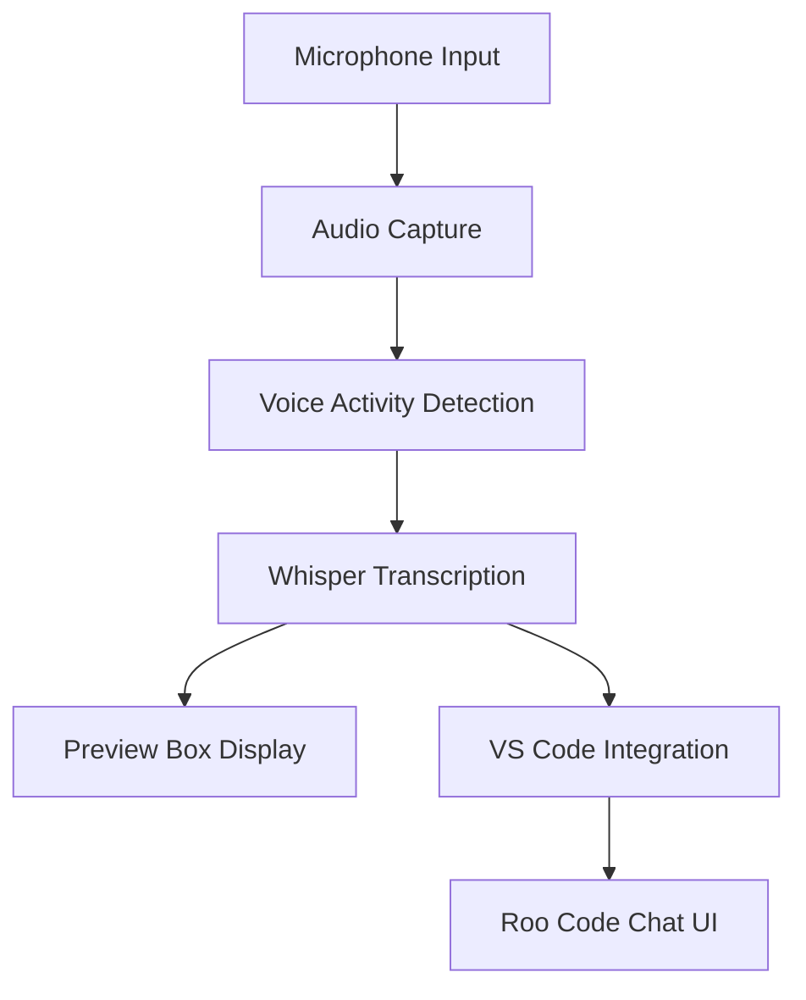
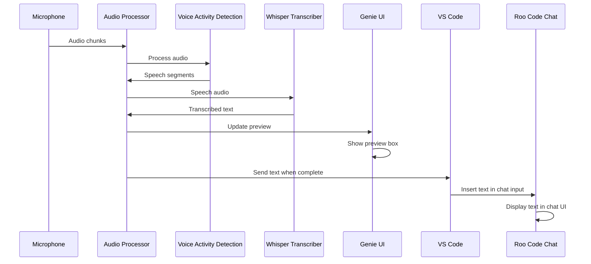

# Voice-to-Text Integration Plan for Genie Whisper

## Overview

This plan outlines how Genie Whisper will capture voice input, process it, and display it both in a preview box and within the VS Code Roo Code plugin chat UI.



## Components and Data Flow

### 1. Audio Capture
- **Input Source**: Microphone (Focusrite Clarett 4 Pre with Shure SM7B)
- **Process**:
  - Audio is captured in real-time at 16kHz, 16-bit PCM
  - Audio is processed in chunks (typically 30ms frames)
  - The audio stream is continuously monitored for speech

### 2. Voice Activity Detection (VAD)
- **Technology**: Hybrid approach using WebRTC VAD (with Silero VAD when available)
- **Process**:
  - The VAD system detects when speech starts and stops
  - Speech segments are identified and isolated
  - Background noise is filtered out
  - Speech segments are passed to the transcription engine

### 3. Whisper Transcription
- **Technology**: OpenAI Whisper (base model by default, configurable)
- **Process**:
  - Speech segments are processed by Whisper in real-time
  - GPU acceleration (RTX 4090) is used for faster processing
  - Transcribed text is generated with punctuation and formatting
  - The text is streamed as it's transcribed, not just at the end of speech

### 4. Preview Box Display
- **UI Component**: Floating preview box in Genie Whisper app
- **Behavior**:
  - Appears automatically when speech is detected
  - Shows transcribed text in real-time as you speak
  - Updates continuously with new transcriptions
  - Displays a visual indicator when processing
  - Fades out after speech ends (configurable delay)

### 5. VS Code Integration
- **Technology**: IDE integration module with clipboard fallback
- **Process**:
  - Transcribed text is formatted according to context
  - Text is prepared for insertion into VS Code
  - Integration module communicates with VS Code extension API
  - Text is inserted at cursor position or in active selection

### 6. Roo Code Chat UI Integration
- **Technology**: VS Code extension API + custom integration
- **Process**:
  - Detects when Roo Code chat UI is active
  - Formats text appropriately for chat context
  - Inserts text into the chat input field
  - Optionally auto-submits the message (configurable)

## User Experience Flow

1. **Activation**:
   - Press hotkey (default: Alt+Shift+G) or say wake word ("Hey Genie")
   - Genie avatar animates to indicate listening mode
   - Waveform visualization shows microphone input

2. **Speaking**:
   - Start speaking into your microphone
   - VAD detects speech and begins processing
   - Waveform visualization shows voice activity

3. **Real-time Preview**:
   - Preview box appears near Genie avatar
   - Transcribed text appears in real-time as you speak
   - Text updates continuously with corrections and additions

4. **VS Code Integration**:
   - When speech ends (or on command), text is prepared for VS Code
   - If Roo Code chat UI is active, text is inserted into chat input
   - Text appears in the chat input field, ready to send

5. **Sending to Roo Code**:
   - Option 1: Auto-send (if configured)
   - Option 2: Manual send (press Enter or click Send)
   - Roo Code processes your transcribed message

## Technical Implementation Details

### Preview Box Implementation

```typescript
// In src/components/TranscriptionPreview.tsx
import React, { useEffect, useState } from 'react';
import { useTranscriptionContext } from '../contexts/TranscriptionContext';

const TranscriptionPreview: React.FC = () => {
  const { isListening, transcription, isFinalizing } = useTranscriptionContext();
  const [visible, setVisible] = useState(false);
  
  useEffect(() => {
    if (isListening || transcription) {
      setVisible(true);
    } else {
      // Fade out after delay
      const timer = setTimeout(() => setVisible(false), 2000);
      return () => clearTimeout(timer);
    }
  }, [isListening, transcription]);
  
  if (!visible) return null;
  
  return (
    <div className="transcription-preview">
      <div className="preview-content">
        {transcription || "Listening..."}
        {isFinalizing && <span className="processing-indicator">Processing...</span>}
      </div>
    </div>
  );
};

export default TranscriptionPreview;
```

### VS Code Integration

```typescript
// In electron/ide-integration.ts
import { clipboard } from 'electron';

export async function sendToVSCode(text: string): Promise<boolean> {
  try {
    // Check if VS Code is active window
    const activeWindow = await getActiveWindow();
    if (!activeWindow.includes('Visual Studio Code')) {
      return false;
    }
    
    // Check if Roo Code chat is active
    const isRooCodeChatActive = await checkRooCodeChatActive();
    
    if (isRooCodeChatActive) {
      // Format text for chat context
      const formattedText = formatForChat(text);
      
      // Insert into chat input
      await insertTextAtCursor(formattedText);
      
      // Optionally auto-submit
      if (getSettings().autoSubmitChat) {
        await simulateEnterKey();
      }
      
      return true;
    } else {
      // Regular VS Code insertion
      await insertTextAtCursor(text);
      return true;
    }
  } catch (error) {
    console.error('VS Code integration error:', error);
    
    // Fallback to clipboard
    clipboard.writeText(text);
    return false;
  }
}
```

### Python Backend for Audio Processing

```python
# In python/audio_processor.py
class AudioProcessor:
    def __init__(self, sample_rate=16000):
        self.sample_rate = sample_rate
        self.vad = HybridVAD(sample_rate=sample_rate)
        self.whisper = WhisperTranscriber(model_size="base")
        self.is_listening = False
        self.current_audio_buffer = []
        
    def process_audio_chunk(self, audio_chunk):
        # Add to buffer
        self.current_audio_buffer.append(audio_chunk)
        
        # Check for speech
        audio_array = np.concatenate(self.current_audio_buffer)
        speech_segments = self.vad.detect_speech(audio_array)
        
        if speech_segments:
            # Speech detected
            self.is_listening = True
            
            # Extract speech segments
            speech_audio = self.extract_speech(audio_array, speech_segments)
            
            # Transcribe
            transcription = self.whisper.transcribe(speech_audio)
            
            # Send to UI
            self.send_transcription_to_ui(transcription)
            
            # If speech ended, finalize
            if self.detect_speech_end(speech_segments):
                self.finalize_transcription()
                self.current_audio_buffer = []
                self.is_listening = False
```

## Communication Between Components



## Configuration Options

1. **Activation Methods**:
   - Hotkey (customizable)
   - Wake word (customizable)
   - Always-on mode

2. **Preview Box**:
   - Position (floating, docked)
   - Size and opacity
   - Fade-out delay
   - Font size and style

3. **VS Code Integration**:
   - Auto-submit in chat (on/off)
   - Format text based on context (code, markdown, plain text)
   - Keyboard shortcut customization

4. **Transcription**:
   - Whisper model selection (tiny, base, small, medium, large)
   - Language selection
   - Punctuation and formatting options

## Implementation Timeline

1. **Phase 1 (Current)**: Basic functionality
   - Audio capture and VAD working ✅
   - Whisper transcription working ✅
   - Preview box implementation ✅
   - Basic VS Code integration ✅

2. **Phase 2 (Next 1-2 weeks)**:
   - Enhance preview box UI and animations
   - Improve Roo Code chat integration
   - Add context-aware formatting
   - Implement auto-submit option

3. **Phase 3 (3-4 weeks)**:
   - Add advanced configuration options
   - Improve accuracy and latency
   - Enhance visual feedback
   - Add multi-language support

## Testing Plan

1. **Audio Capture Testing**:
   - Test with different microphones
   - Test in noisy environments
   - Test with different speech patterns and accents

2. **VS Code Integration Testing**:
   - Test with different VS Code versions
   - Test with and without Roo Code plugin
   - Test in different editor contexts (code files, markdown, etc.)

3. **End-to-End Testing**:
   - Test complete flow from speech to Roo Code chat
   - Measure latency and accuracy
   - Test with real-world usage scenarios

## Challenges and Solutions

### Challenge 1: Latency
- **Problem**: Delay between speaking and seeing text in the preview
- **Solution**: 
  - Stream partial results from Whisper
  - Use GPU acceleration
  - Optimize audio chunk size
  - Implement caching for common phrases

### Challenge 2: Accuracy
- **Problem**: Transcription errors, especially with technical terms
- **Solution**:
  - Use domain-specific fine-tuning
  - Implement custom vocabulary
  - Add post-processing for code syntax
  - Allow manual corrections

### Challenge 3: VS Code Integration
- **Problem**: Reliable text insertion in different contexts
- **Solution**:
  - Use VS Code extension API when available
  - Implement clipboard fallback
  - Detect active editor context
  - Add context-aware formatting

## Next Steps

1. Finalize the TranscriptionPreview component implementation
2. Enhance the IDE integration module for Roo Code chat detection
3. Implement streaming transcription for real-time preview updates
4. Add configuration options for preview box appearance and behavior
5. Test end-to-end flow with Roo Code chat UI