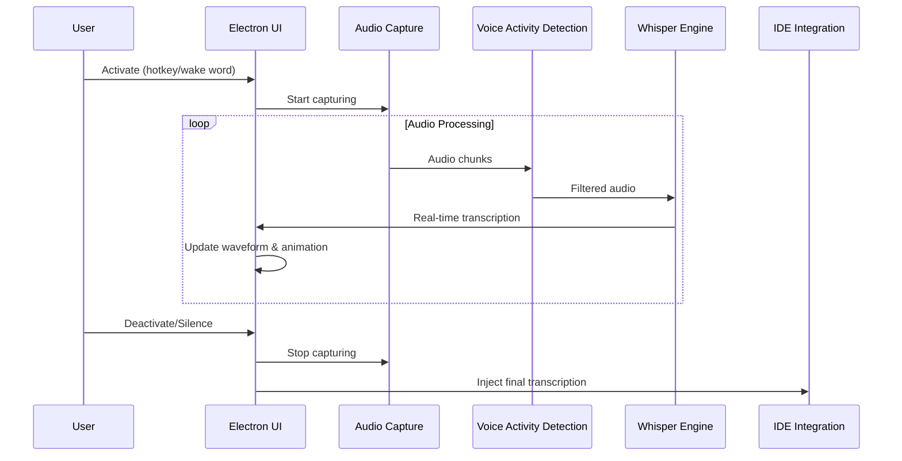

# System Patterns: Genie Whisper

## System Architecture

### High-Level Architecture
Genie Whisper follows a hybrid architecture combining an Electron-based frontend with a Python backend:

```
┌─────────────────────────────────────────────────────────────┐
│                     Electron Frontend                        │
├─────────────┬─────────────────────────┬────────────────────┤
│  UI Overlay │ Waveform Visualization  │  Genie Animation   │
├─────────────┴─────────────────────────┴────────────────────┤
│                  IPC Communication Layer                    │
└───────────────────────────┬─────────────────────────────────┘
                            │
┌───────────────────────────┴─────────────────────────────────┐
│                      Python Backend                          │
├─────────────┬─────────────────────────┬────────────────────┤
│ Audio Input │    Whisper Engine       │   VAD Filtering    │
└─────────────┴─────────────────────────┴────────────────────┘
```

### Component Relationships

#### Frontend Components
- **Main Process**: Manages application lifecycle, system tray, and global shortcuts
- **Renderer Process**: Handles UI rendering, animations, and user interactions
- **Overlay Window**: Provides floating UI that works across applications
- **Settings Panel**: Configures application behavior and preferences
- **IDE Integration**: Injects transcribed text into target applications

#### Backend Components
- **Audio Capture**: Interfaces with system microphone
- **Voice Activity Detection**: Filters speech from background noise
- **Whisper Engine**: Performs speech-to-text transcription
- **Buffer Manager**: Handles audio streaming and chunking
- **IPC Bridge**: Communicates between Python and Electron

### Data Flow



## Key Technical Decisions

### 1. Hybrid Electron + Python Architecture
**Decision**: Use Electron for the frontend and Python for the backend.

**Rationale**:
- Electron provides cross-platform UI capabilities and system integration
- Python offers superior audio processing and ML model integration
- This combination leverages the strengths of both platforms

**Alternatives Considered**:
- Pure Electron/Node.js: Limited ML and audio processing capabilities
- Pure Python with GUI: Less polished UI and system integration
- Web application: Limited system-level access

### 2. Local-First Transcription
**Decision**: Prioritize local transcription with cloud fallback.

**Rationale**:
- Ensures privacy for sensitive development work
- Reduces latency by eliminating network dependencies
- Provides reliability in offline environments
- Cloud fallback offers flexibility when higher accuracy is needed

**Alternatives Considered**:
- Cloud-only: Better accuracy but privacy/latency concerns
- Local-only: Privacy but limited by local compute resources

### 3. Voice Activity Detection (VAD)
**Decision**: Implement VAD filtering before transcription.

**Rationale**:
- Reduces processing of non-speech audio
- Improves transcription accuracy by filtering noise
- Prevents accidental transcription of background conversations
- Saves computational resources

**Alternatives Considered**:
- Post-processing filtering: Less efficient, higher compute cost
- Manual activation only: More user friction

### 4. Global Overlay Approach
**Decision**: Implement as a global overlay rather than per-application plugins.

**Rationale**:
- Works across all applications without individual integrations
- Consistent user experience regardless of environment
- Simpler maintenance than multiple plugins
- More flexible for future expansion

**Alternatives Considered**:
- Individual IDE extensions: Better integration but fragmented experience
- OS-level accessibility features: Limited customization

## Design Patterns

### 1. Event-Driven Architecture
The system uses an event-driven architecture to handle asynchronous audio processing and UI updates:
- Audio capture events trigger processing pipelines
- Transcription events update UI components
- User interaction events control system behavior

### 2. Pipeline Pattern
Audio processing follows a pipeline pattern:
```
Microphone Input → Chunking → VAD Filtering → Whisper Processing → Text Output
```
Each stage processes data and passes it to the next, allowing for modular components and easy pipeline reconfiguration.

### 3. Observer Pattern
UI components observe the state of the transcription system:
- Waveform visualization observes audio input
- Genie animation observes transcription status
- Settings panel observes system configuration

### 4. Adapter Pattern
IDE integration uses adapters to normalize interactions with different environments:
- VS Code adapter
- Cursor adapter
- Roo Code adapter
- OpenAI chat adapter

### 5. Strategy Pattern
Transcription uses a strategy pattern to switch between different modes:
- Local Whisper.cpp strategy
- Faster-Whisper strategy
- Cloud API strategy

## Technical Constraints

### Performance Constraints
- Transcription latency must be under 1 second
- CPU usage should not impact IDE performance
- Memory footprint should be minimal when inactive

### Compatibility Constraints
- Must work across Windows, macOS, and Linux
- Must integrate with specified IDEs and tools
- Must support various microphone setups

### Security Constraints
- Local processing for sensitive code
- No unnecessary network communication
- Clear user control over when system is active

## System Interfaces

### External Interfaces
- **Microphone API**: System audio input
- **IDE Text Fields**: Target for transcription output
- **System Tray**: Application control
- **Global Hotkeys**: Activation triggers

### Internal Interfaces
- **Electron-Python IPC**: Communication between frontend and backend
- **Audio Buffer Interface**: Streaming audio data
- **Transcription Stream**: Real-time text output
- **Configuration Interface**: Settings management

## Deployment Architecture

### Development Environment
- Local development with hot-reloading
- Separate frontend and backend processes
- Debug logging and visualization

### Production Environment
- Packaged Electron application with embedded Python
- Optimized Whisper models
- Minimal logging
- Auto-update capability

## Error Handling Strategy

### Graceful Degradation
- Fall back to cloud API if local transcription fails
- Provide clear error messages for audio device issues
- Cache settings in case of configuration corruption

### Recovery Mechanisms
- Auto-restart backend on crash
- Reconnect to audio devices when available
- Restore previous state after system sleep/wake